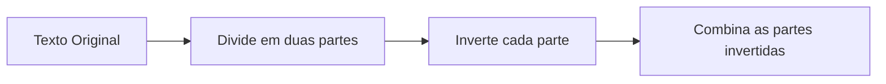

# 📝 Criptografia e Descriptografia Web

 


## 📌 Visão Geral

Este é um projeto que implementa um sistema de criptografia e descriptografia de texto usando técnicas de deslocamento de caracteres e manipulação avançada de dados. A ferramenta permite ao usuário criptografar e descriptografar textos de forma simples ou avançada, com suporte a parâmetros como "nível de codificação", "deslocamentos" e "trash interval". O projeto tem como objetivo fornecer uma abordagem segura e flexível para manipulação de dados. A ferramenta oferece:

- 🔐 Criptografia com múltiplos níveis de segurança
- 🔓 Descriptografia precisa
- 🎚️ Dois modos de operação (simples e avançado)
- ⚙️ Controle total sobre parâmetros de codificação

## 🛠️ Como Funciona o Algoritmo

O algoritmo utiliza uma combinação de quatro operações principais:

### 1. Divisão e Rearranjo do Texto
A primeira etapa do algoritmo divide o texto de entrada em duas partes, invertendo a ordem dos caracteres. Essa operação visa "embaralhar" o texto, tornando mais difícil a reversão imediata.



**Exemplo Prático:**
```
Texto Original: "Segredo"
→ Divide: "Seg" + "redo"
→ Inverte: "geS" + "oder"
→ Resultado: "geSoder"
```

### 2. Cifra Alternada com Deslocamento
- Alterna entre adição e subtração nos valores ASCII
- Ciclo baseado no nível de codificação
- Deslocamentos customizáveis

O próximo passo é aplicar uma cifra alternada. O texto é processado e o valor de cada caractere é alterado com base no nível de codificação e no deslocamento fornecido pelo usuário.
Em um ciclo alternado, o deslocamento (definido pelo usuário) é adicionado ou subtraído dos valores ASCII dos caracteres. Para caracteres em posições ímpares, o deslocamento é subtraído, e para posições pares, é somado.

**Fórmula:**
```
Para cada caractere na posição i:
  Se i % 2 == 0: charCode + deslocamento[i % encodeLevel]
  Se i % 2 != 0: charCode - deslocamento[i % encodeLevel]
```

### 3. Inserção de Caracteres Aleatórios
Após a cifra, o texto criptografado é alterado ainda mais com a inserção de caracteres aleatórios (chamados de "lixo") em intervalos definidos pelo usuário. Isso aumenta a complexidade da criptografia, afim de dificultar a leitura.

### 4. Inversão Final
Última camada de proteção que inverte toda a string
Finalmente, o texto resultante é invertido, para criar um nível adicional de complexidade. A inversão de strings impede que uma análise simples seja suficiente para restaurar o texto original.

### 5. Descriptografia
A descriptografia reverte todas essas operações, de forma sequencial

## 🚀 Como Usar

### Criptografar Texto
1. Selecione o modo (Simples/Avançado)
2. Insira o texto original
3. Defina os parâmetros:
   - Nível de codificação (1-10)
   - Deslocamentos (separados por vírgula)
   - Intervalo de lixo (1-10)
4. Clique em "Gerar Criptografia"

### Descriptografar Texto
1. Cole o texto criptografado
2. Insira os parâmetros usados na criptografia
3. Clique em "Descriptografar"

## 💡 Exemplos Práticos

### Exemplo Básico
```yaml
Entrada:
  Texto: "Hello"
  Nível: 2
  Deslocamentos: [1,3]
  Intervalo Lixo: 2

Saída:
  Criptografado: "m9lIIbm"
  Chave": "2;1,3;2"
  Descriptografado: "Hello"
```

### Exemplo Avançado
```javascript
{
  "textoOriginal": "Dados Sensíveis",
  "parametros": {
    "nivelCodificacao": 3,
    "deslocamentos": [2,5,1],
    "intervaloLixo": 3
  },
  "resultado": {
    "criptografado": "[onï?w`kKt?c1ejuI!Ng",
    "chave": "3;2,5,1;3"
  }
}
```

## 🛡️ Considerações de Segurança

- 🔄 Valores ASCII são normalizados para evitar overflow
- 🚫 Validação rigorosa de todos os inputs
- ⚠️ Avisos claros para entradas inválidas
- 🔒 Cálculos seguros de descriptografia

## 📚 Tecnologias Utilizadas

- **Frontend**: HTML5, CSS3, JavaScript ES6+
- **Algoritmos**: Cifra customizada com múltiplas camadas
- **UX**: Design responsivo e acessível

## 🤝 Como Contribuir

1. Faça um fork do projeto
2. Crie uma branch para sua feature (`git checkout -b feature/suaFeature`)
3. Commit suas mudanças (`git commit -m 'Adiciona sua feature'`)
4. Push para a branch (`git push origin feature/suaFeature`)
5. Abra um Pull Request

## 📜 Licença

Distribuído sob licença MIT. Veja `LICENSE` para mais informações.

---

**Nota**: Este projeto foi desenvolvido para fins educacionais e de demonstração. Para aplicações críticas de segurança, recomenda-se o uso de algoritmos padrão da indústria como AES ou RSA.